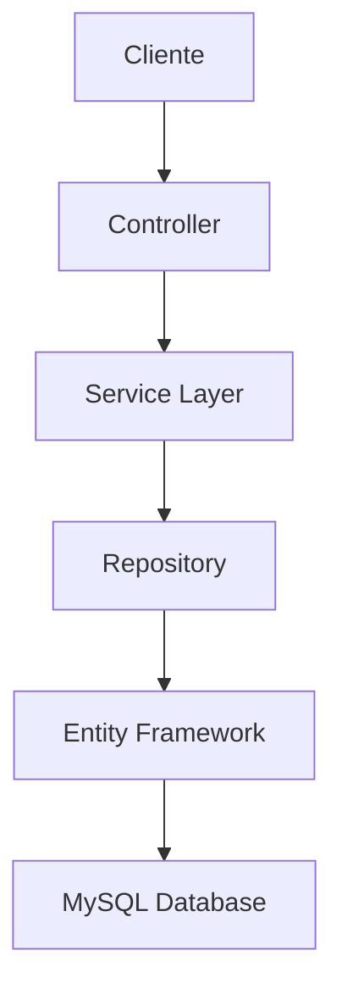

# Perla Metro - Stations Service

Servicio de administración de estaciones.

## Descripción

El Stations Service es uno de los modulos que componen la arquitectura monolito modular de Perla Metro.

# Arquitectura

Este proyecto utiliza una Clean Architecture con una estructura modular que promueve la separación,
las pruebas y la mantenibilidad. 

## Estructura del proyecto
```
perla-metro-stations-service/
├── src/
│   ├── Controllers/          # Controladores de API
│   ├── Data/                 # Contexto de BD y seeding
│   ├── DTOs/                 # DTO para los objetos
│   ├── Helper/               # Facilitadores
│   ├── Mappers/              # Mapeo para DTOs y modelos
│   ├── Interfaces/           # Contratos de servicios
│   ├── Models/               # Entidades de dominio
│   ├── Repository/           # Implementación de repositorios
│   └── Services/             # Lógica de negocio
├── docker-compose.yml        # Configuración Docker
├── Dockerfile               # Imagen de la aplicación
└── Program.cs               # Punto de entrada
```
# Flujo de los datos


# Tecnologias usadas

## Tecnologías principales

- **.NET 8:** Plataforma de desarrollo
- **ASP.NET Core:** Web API framework
- **Entity Framework Core:** ORM para las operaciones de base de datos
- **MySQL:** Base de datos
  
## Heramientas de desarrollo

- **Swagger/OpenAPI:** documentación de API

## DevOps y despliegue

- **Docker**: Contenedores
- **GitHub**: CI/CD pipeline
- **Render**: Despliegue en la nube

# Requisitos

## Desarrollo Local

- [.NET SDK 8.0 o superior](https://dotnet.microsoft.com/es-es/download)
- [Docker y Docker compose](https://www.docker.com/products/docker-desktop/)
- [Git](https://git-scm.com/)
- [Visual Studio Code 1.95.3](https://code.visualstudio.com/download) o superior

# Instalación y configuración

1. Clonar el repositorio
```
https://github.com/bemoremore/perla-metro-stations-service.git
```
2. Navegar al proyecto
```
cd perla-metro-stations-service
```

# Configuración con docker

3.1. Establecer las credenciales del archivo .env proporcionadas.

```
notepad .env
```
o crear el archivo `.env` debe ser creado a la altura de `perla-metro-stations-service/`

3.2. Armar el proyecto utilizando docker compose para probarlo en **producción**

```
docker compose up --build -d
```
Un contenedor de docker va a correr la aplicación web en un puerto 8080

3.3. Acá puede visualizar las rutas ingresando la variable de entorno "API_KEY" como autorización
```
http://localhost:8080/swagger
```

3.4 Armar el proyecto utilizando docker compose para probarlo en **desarrollo con MySQL local** utilizando las variables de entorno .env.example

```
notepad .env
```

Con las credenciales de .env.example

3.5 Armar el proyecto con docker compose

```
docker-compose -f local-compose.yaml up --build
```

Se aplicaran las migraciones, sedeo y funcionamiento del programa, corriendo en el puerto 5000

3.6. Acá puede visualizar las rutas ingresando la variable de entorno "API_KEY" como autorización

```
http://localhost:5000/swagger
```

# Configuración sin docker

4.1. Restaurar las dependencias

```
dotnet restore
```

4.2. Ejecutar el proyecto

```
dotnet run
```

4.3. Acá puede visualizar las rutas ingresando la variable de entorno "API_KEY" como autorización, si no esta utilizando el puerto 5000

```
http://localhost:5000/swagger
```
# Variables de entorno

La aplicación ocupa las variables de entorno como se menciona a la hora de configurar el proyecto.
Estas archivo `.env` debe ser creado a la altura de `perla-metro-stations-service/`

```
DB_HOST=""
DB_PORT=""
DB_NAME=""
DB_USER=""
DB_PASSWORD=""
DB_ROOT_PASSWORD=""
API_KEY=""

ASPNETCORE_ENVIRONMENT=Development
```

# Data seeder

Como se menciona al realizar dotnet run o docker compose up las migraciones se cargaran automaticamente.

El seeder contiene:

- 7 Estaciones ( 6 activas y 1 inactiva )

# API Endpoints

| Método   | Endpoint | Descripción   |
|----------|------|----------|
| GET      | BASE_URL/api/Stations  | Obtener todas las estaciones   |
| GET   | BASE_URL/api/Stations/{id}   | Obtener una estación por ID |
| POST    | BASE_URL/api/Stations  | Crear nueva estación|
| PUT     | BASE_URL/api/Stations/{id} | Actualizar estación | 
| DELETE | BASE_URL/api/Stations/{id} | Eliminar estación | 

# Patrones de diseño

## 1.- Patrón Repository

- **Ubicación:** src/Repository/
- **Propósito:** Abstracción del acceso a datos
  
## 2.- DTO

- **Ubicación:** src/DTOs/
- **Propósito:** Desacopla la conexión de los modelos del dominio.

## 3.- Mapper

- **Ubicación:** src/Mappers/
- **Propósito:** Ayuda la traducción con DTOs y modelos.
  


